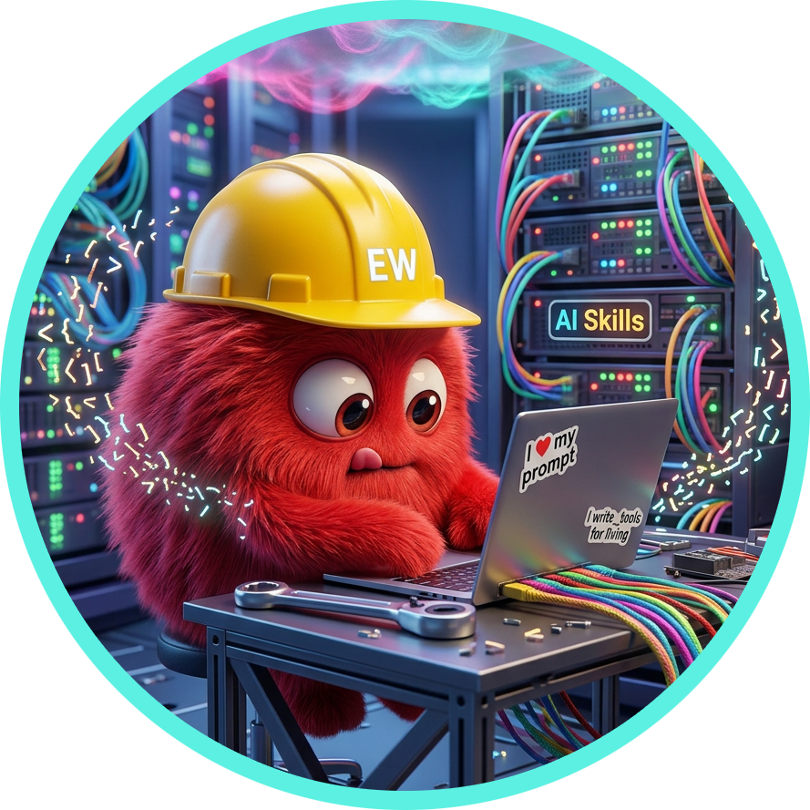

<!-- prettier-ignore -->
<div align="center">

# EW Extensions

[](https://github.com/ai-ecoverse/vibe-coded-badge-action)



[](https://github.com/exp-workspace/ew-extensions/actions)
[](https://nodejs.org)
[](https://www.openjs.org)
[](LICENSE)

[Overview](#overview) | [Extensions](#extensions) | [Architecture](#architecture) | [Local development](#local-development) | [Adding an extension](#adding-an-extension)

</div>

## Overview

This repository hosts **extensions** for the Experience Workspace (EW). Each extension is a self-contained [DA App SDK](https://docs.da.live/developers/guides/developing-apps-and-plugins) application deployed on its own AEM Edge Delivery Services site and loaded into the EW shell.

Extensions add capabilities to EW — editors, panels, tools, and integrations — without modifying the core platform.

## Extensions

| Extension | Path | Entry point | Description |
|-----------|------|-------------|-------------|
| **Skills Editor** | `apps/skills/` | `tools/skills.html` | Manage skills, agents, MCP servers, prompts, and memory |

> More extensions coming soon.

## Architecture

Every extension follows the same pattern:

1. **Block contract** — each extension exports a `decorate(block)` function, loaded by da-nx's `loadBlock` via `providers.ew` routing (triggered by the `ew-` class prefix).
2. **EW hosts the extension** at `da.live/apps/{extension}#/{org}/{site}`. The page contains a `<div class="ew-{extension}">` that `loadBlock` resolves to this repo.
3. **Extension component** — a LitElement (or vanilla JS module) that owns its own UI, state, and data operations against the DA Admin API.

## Local development

To develop locally, run three servers:

```bash
# 1. da-live (port 3000)
cd ~/Projects/DA/da-live && aem up

# 2. da-nx (port 6456)
cd ~/Projects/DA/da-nx && npm start

# 3. ew-extensions (port 3001)
cd ~/Projects/DA/da-skills && aem up
```

Then navigate to:

```
http://localhost:3000/apps/skills?nx=local&nxver=2#/{org}/{site}
```

The `?nx=local&nxver=2` params tell da-live to load da-nx from localhost, which in turn resolves `ew-*` blocks to `:3001`.

For isolated extension development (no auth, no da-nx routing):

```
http://localhost:3001/apps/skills/skills.html
```

## Adding an extension

Use the **new-extension** Cursor Agent Skill to scaffold a new extension with the correct structure:

```
.cursor/skills/new-extension/
```

The skill creates all boilerplate files (block contract, LitElement component, CSS, standalone HTML, test stubs) and walks you through lint/test wiring and da-live integration.

For manual setup, see `blocks/skills/` (block extension) or `tools/ew-setup/` (tool extension) as reference implementations.

## Authentication

The DA App SDK handles authentication for all extensions. When EW loads an extension in an iframe, the SDK passes the user's IMS access token via PostMessage. Extensions call `initAuth(token)` to configure subsequent DA Admin API requests.

No separate login flow is needed — the user is already authenticated in EW.

## CI

Linting (ESLint + Stylelint) runs on every push that touches `apps/`. E2e tests (Playwright) are available locally — see `test/e2e/README.md` for the tiered test strategy.
